# Application Angular

## Structure de la page
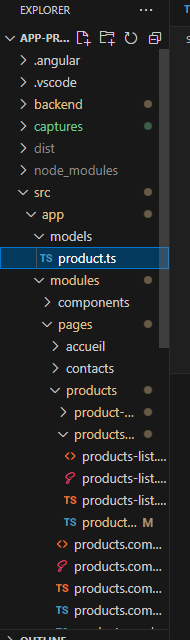

## Creation des modèles
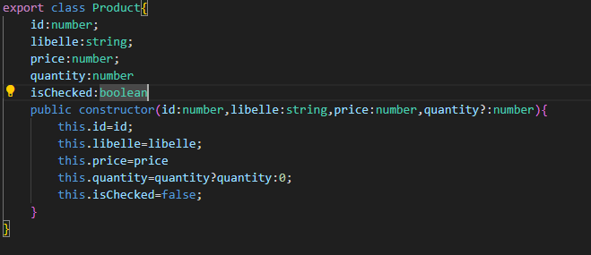

## Creation du module ShareModule
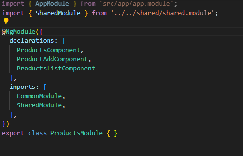

## Creation du module ProductModule
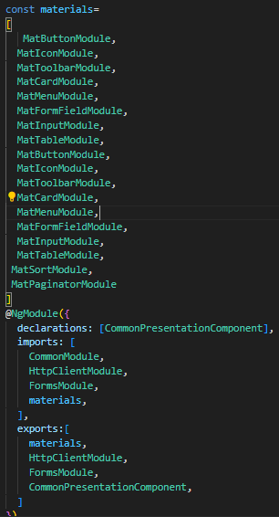

## Structure de la Presentation
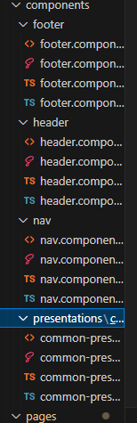

## Creation des components , des services et liaison avec json-server
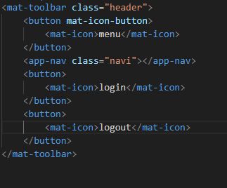
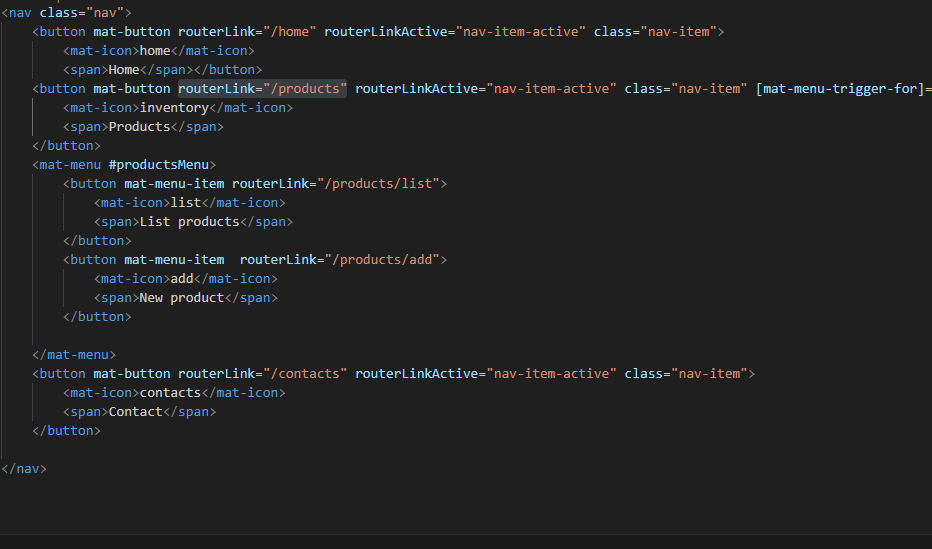
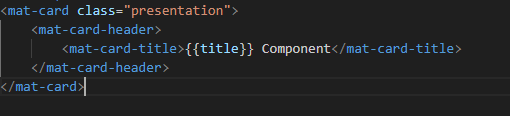
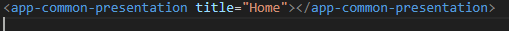
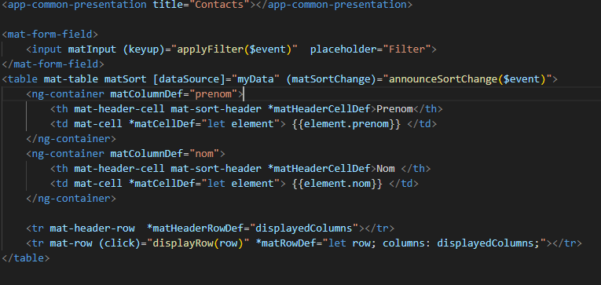

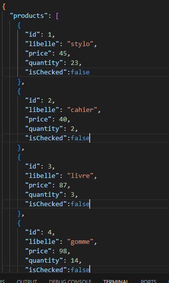
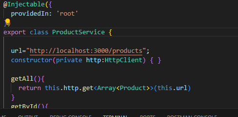
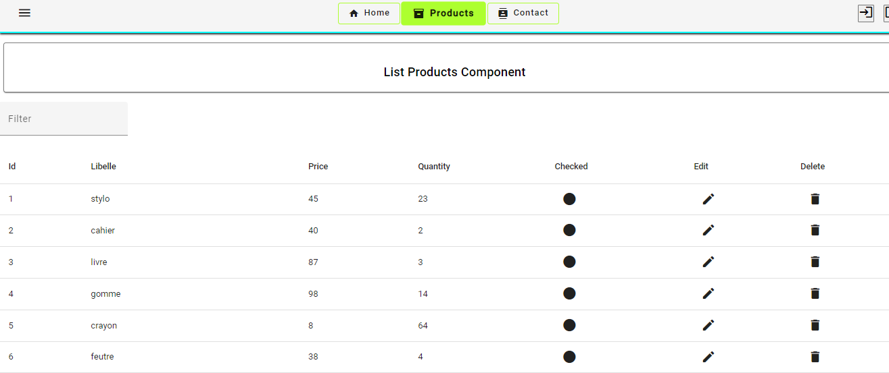
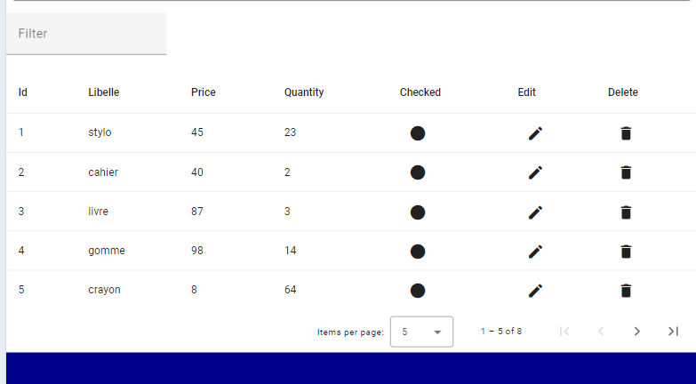
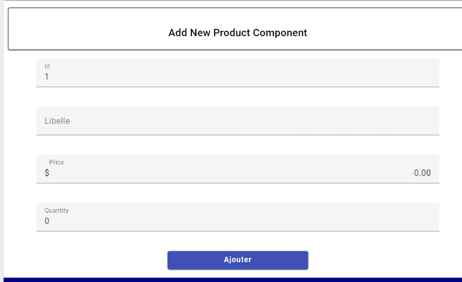