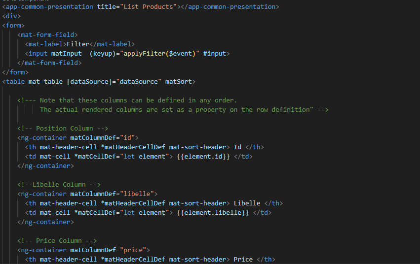

# Application Angular

## Structure de la page

## Creation des modèles

## Creation du module ShareModule

## Creation du module ProductModule

## Structure de la Presentation

## Creation des components , des services et liaison avec json-server

